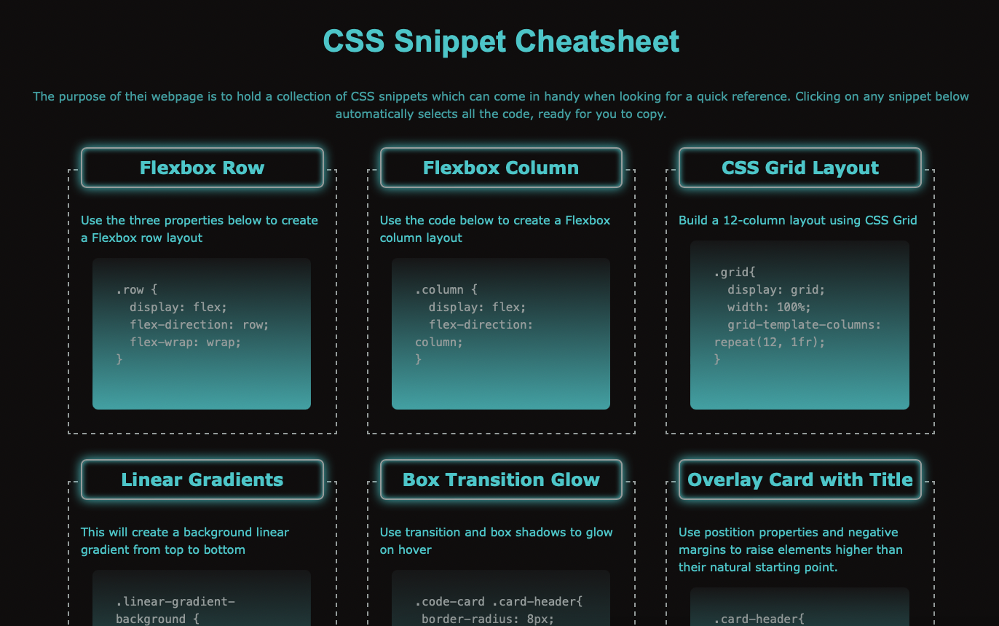
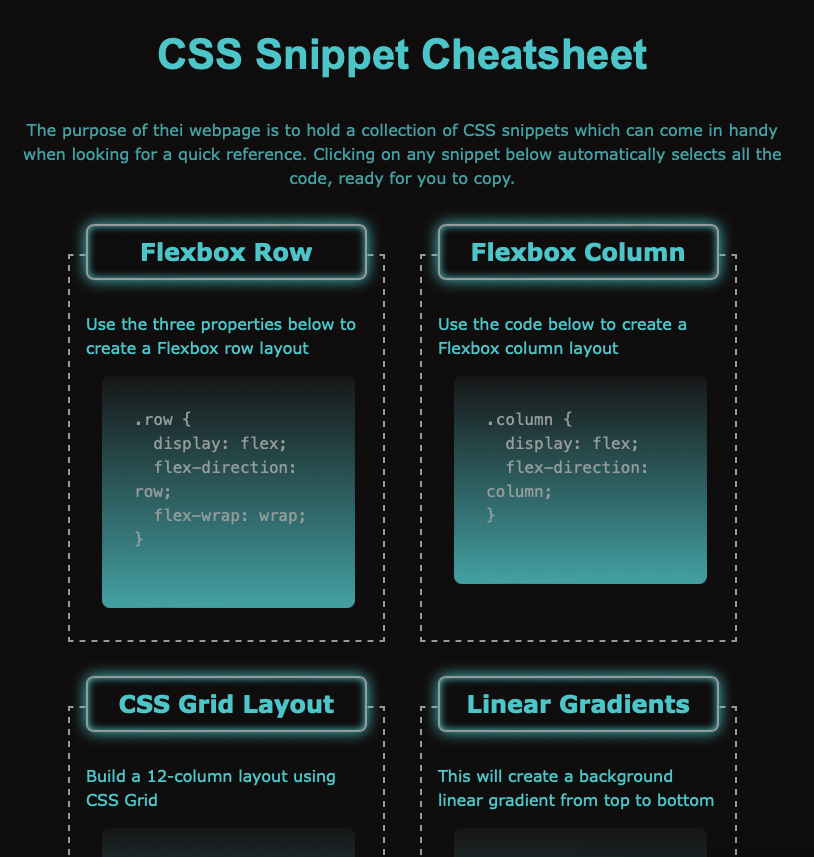
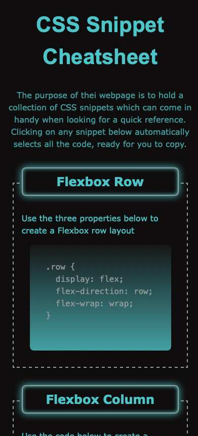

# CSS Snippet Cheatsheet

## Project Overview

This cheatsheet holds a collection of CSS snippets. In this project, I have used: 
* Semantic HTML elements
* CSS Variables for my color scheme and
* Flexbox and media queries to create a responsive layout.

## Technologies Used

* HTML
* CSS

## Live Application
https://ladykays.github.io/css-snippet-cheetsheet/

## Hint

Checkout the responsiveness of the page by resizing your browser window or viewing the page on a tablet or mobile phone.

## Screenshot

#### Desktop

#### Tablet

#### Mobile

## Licence

Please refer to the LICENCE in the repo.

